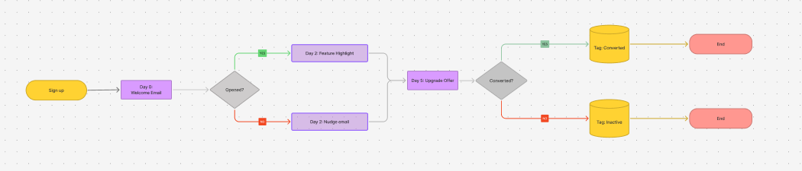
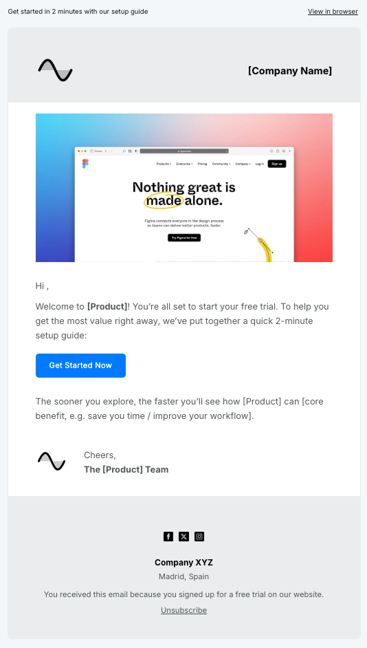
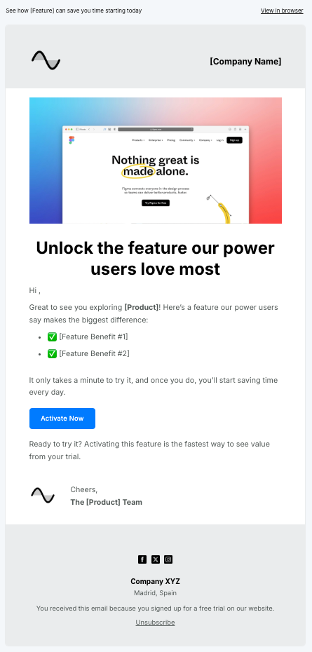
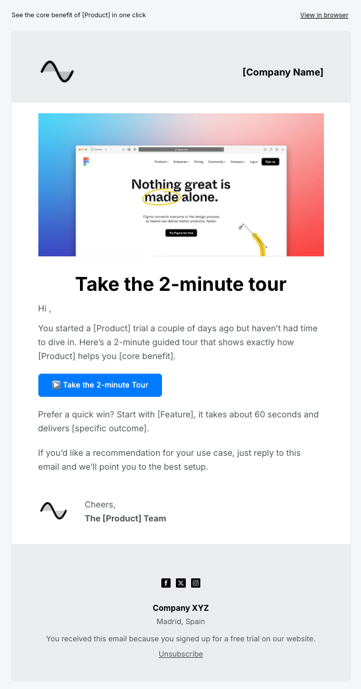
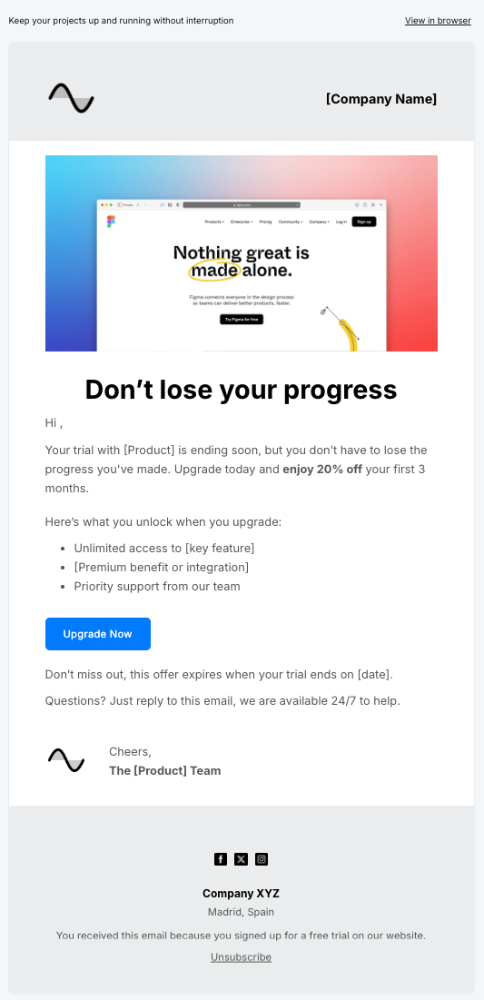

# Welcome & Onboarding Flow

## Goal

The goal of this flow is to activate trial users within their first week by delivering early value. Engaged users receive a feature highlight, while inactive users get a reminder email to reduce drop-off. The flow is designed around a 5-day trial period but can be adapted to different timelines.

## Strategy

- Trigger: New signup
- Segments: Active vs inactive users
- Channels: Email
- Timing: 4 touches across 5 days (adaptable to trial length)
- KPIs: Activation rate, CTR, Trial-to-Paid conversion

## Flow Diagram



### Legend

- 🟨 **Trigger** = Signup event
- 🟪 **Email** = Automated email step
- 🔷 **Decision** = Condition check (e.g. Opened? Converted?)
- 🟨 **CRM Update** = Tag in database (e.g. Converted, Inactive)
- 🟥 **End** = Exit point

## Email Examples
Below are 4 emails included in the flow, with subject, preheader, purpose, and plain-text body examples.  

- **Day 0 – Welcome Email** 
  **Subject**: Welcome to [Product] — here’s your first quick win  
  **Preheader**: Get started in 2 minutes with our setup guide  
  **Purpose**: Guide users to quick setup and highlight immediate value  
  **Body (plain text)**:

```
Hi [First Name],

Welcome to [Product]! You’re all set to start your free trial.
To help you get the most value right away, we’ve put together
a quick 2-minute setup guide:

[CTA button: Get Started Now]

The sooner you explore, the faster you’ll see how [Product]
can [core benefit, e.g. save you time / improve your workflow].

Cheers,
The [Product] Team
```

<!--  -->
---

- **Day 2 – Feature Email (Active Users)**
  **Subject**: Unlock the feature our power users love most  
  **Preheader**: See how [Feature] can save you time starting today  
  **Purpose**: Drive activation of key product feature that increases retention  
  **Body (plain text)**:

```
Hi [First Name],

Great to see you exploring [Product]!
Here’s a feature our power users say makes the biggest difference:

✅ [Feature Benefit #1]
✅ [Feature Benefit #2]

It only takes a minute to try it — and once you do, you’ll
start saving time every day.

[CTA Button: Activate Now]

Ready to try it? Activating this feature is the fastest way
to see value from your trial.

Cheers,
The [Product] Team
```
<!--  -->
---

- **Day 2 – Nudge Email (Inactive Users)**  
  **Subject**: Haven’t had a chance to explore? Here’s why it’s worth it  
  **Preheader**: See the core benefit in one click  
  **Purpose**: Reactivate inactive users with a value reminder and low-friction next step  
  **Body (plain text)**:

```
Hi [First Name],

You started a [Product] trial a couple of days ago but haven’t
had time to dive in.
Here’s a 2-minute guided tour that shows exactly how [Product]
helps you [core benefit].

[CTA Button: Take the 2-minute Tour]

Prefer a quick win? Start with [Feature] — it takes about 60 seconds
and delivers [specific outcome].

If you’d like a recommendation for your use case, just reply to this
email and we’ll point you to the best setup.

Cheers,
The [Product] Team
```
<!--  -->
---

- **Day 5 – Upgrade Offer**  
  **Subject**: Trial expiring: lock in 20% off before it’s gone  
  **Preheader**: Keep your projects up & running without interruption  
  **Purpose**: Create urgency and convert trial users before expiry  
  **Body (plain text)**:
```
Hi [First Name],

Your trial with [Product] is ending soon, but you don’t have to lose 
the progress you've made. 
Upgrade today and enjoy 20% off your first 3 months.

Here’s what you unlock when you upgrade:
• Unlimited access to [key feature]  
• [Premium benefit or integration]  
• Priority support from our team  

[CTA Button: Upgrade Now]

Don’t miss out, this offer expires when your trial ends on [date].

Questions? Just reply to this email, we are available 24/7 to help.

Cheers,  
The [Product] Team
```
<!--  -->

## Results (Hypothetical)

- 40% open rate on Welcome Email (industry avg: 25%)  
- 12% CTR on Feature Highlight (above benchmark of ~7%)  
- 8% of inactive users reactivated via Nudge Email  
- 15% increase in trial-to-paid conversion rate (vs control)

## Insights

- Early activation is the strongest driver of conversion — users who engaged with a key feature within 2 days were significantly more likely to upgrade.  
- Inactivity sets in quickly; a targeted nudge at Day 2 helped recover 8% of otherwise lost users.  
- A clear, time-bound upgrade offer at the end of the trial created urgency and delivered measurable lift in paid conversions.  

**Conclusion**: This flow demonstrates how structured lifecycle messaging, from activation nudges to time-bound offers, can turn short trials into long-term customers.
