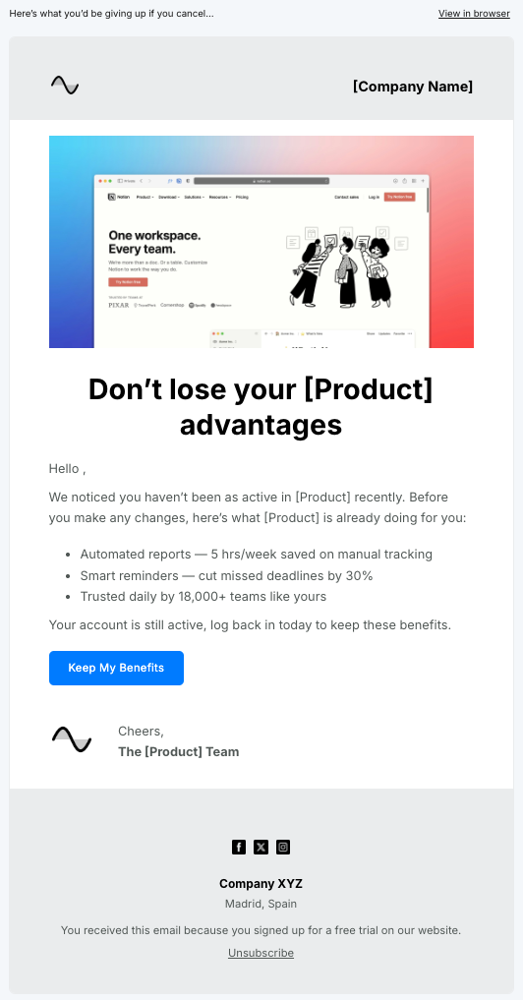
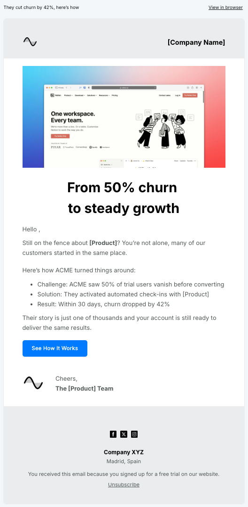
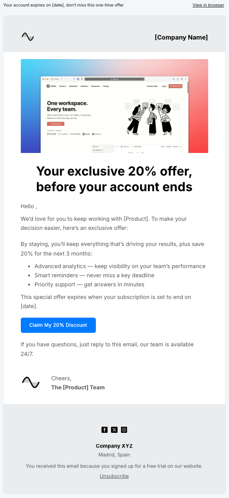

# Churn reduction Flow

## Goal

Reduce voluntary churn by re-engaging at-risk customers before cancellation. The flow aims to remind users of the value they’re getting, reinforce trust with social proof, and offer a last-chance incentive to retain them.

## Strategy

- Trigger: Low activity in last 14 days || Attempt to cancel or downgrade
- Segments: at-risk (inactive + downgrade intent) vs active (no action taken, excluded from the flow)
- Channels: Email (plus in-app if relevant)  
- Timing: 2–3 touches across the final 14 days before cancellation/renewal
- KPIs: Retention rate, CTR, “Save offer” acceptance, Reduced cancellations

## Flow Diagram


### Legend

- 🟨 **Trigger** = Inactivity or cancel intent event  
- 🟪 **Email** = Automated email step  
- 🔷 **Decision** = Condition check (e.g. Opened? Clicked? Accepted?)  
- ⏱️ **Delay** = Wait period before next step (e.g. 24h, 72h, 96h)  
- 🟨 **CRM** Update = Tag in database (e.g. Retained, Churned)  
- 🟥 **End** = Exit point  


## Email Examples
_Note: Personalisation tokens shown in generic format for clarity._

- **Email #1 – Value Reminder**  
  **Subject**: Keep [Product] working for you every day  
  **Preheader**: [Feature] makes your work easier — don’t lose it now  
  **Purpose**: Remind users of the product’s core value and benefits they’ve already experienced  
  **Body (plain text)**:  

```
Hi [First Name|there],

We noticed you haven’t been as active in [Product] recently.  
Before you make any changes, here’s what [Product] is already doing for you:

• [Feature 1] — helps you [save time / reduce effort]  
• [Feature 2] — gives you [clearer insights / faster results]  
• [Feature 3] — trusted by [X,000] users every day  

Your account is still active — log back in today and keep those benefits working for you:  

[CTA Button: Pick Up Where I Left Off]

Cheers,
The [Product] Team
```

<!--  -->
---

- **Email #2 – Success Story (Proof/Trust Builder)**  
  **Subject**:  
  **Preheader**:  
  **Purpose**:  
  **Body (plain text)**:  

```
Hi [First Name],

Cheers,
The [Product] Team
```
<!--  -->
---

- **Email #3 – Save Offer**  
  **Subject**:  
  **Preheader**:  
  **Purpose**:  
  **Body (plain text)**:  

```
Hi [First Name],

Cheers,
The [Product] Team
```
<!--  -->

## Results (Hypothetical)
- X% of at-risk users re-engaged  
- Y% uplift in retention rate  
- Z% “Save offer” acceptance  
- CTR improvement vs control  

## Insights
- Value-focused messaging reactivates disengaged users more effectively than generic nudges.  
- Social proof builds trust before introducing an incentive.  
- Incentives must be time-bound and reserved for users at real risk.  

**Conclusion**: A structured churn-save sequence can reduce voluntary churn by re-engaging at-risk users with a balance of value reminders, social proof, and incentives.
