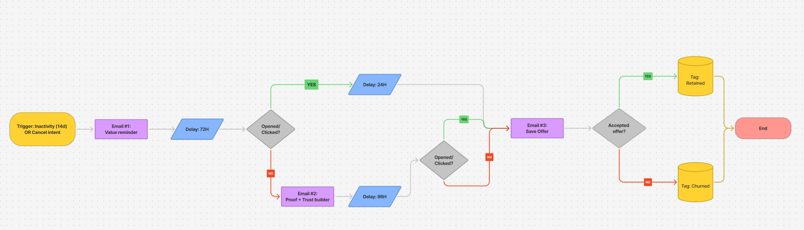
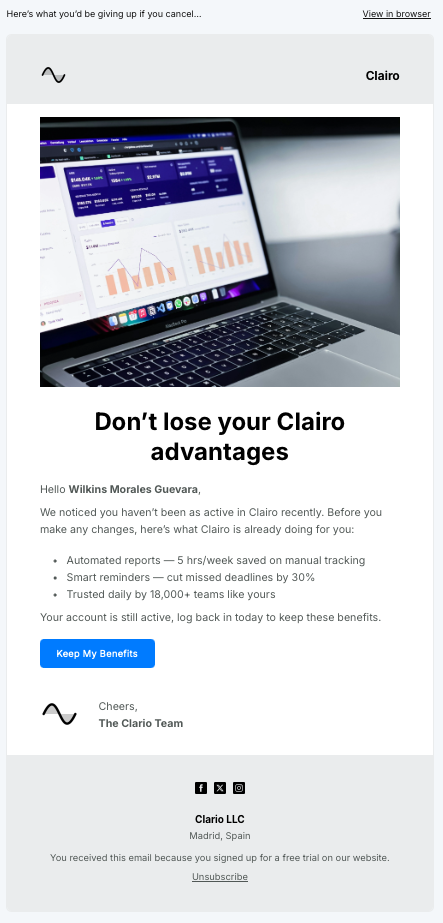
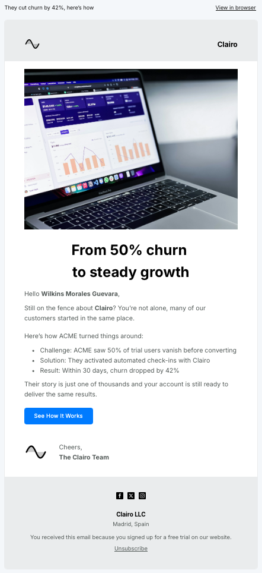
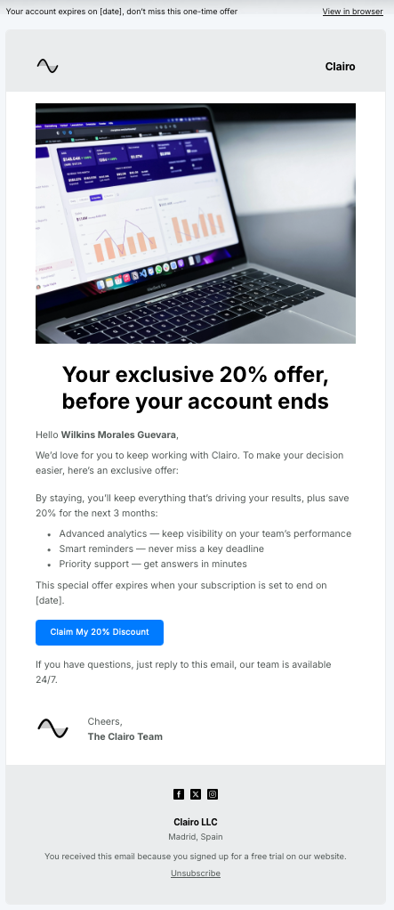

# Churn Reduction Flow

## Goal

Reduce voluntary churn by re-engaging at-risk customers before cancellation. The flow aims to remind users of the value they’re getting, reinforce trust with social proof, and offer a last-chance incentive to retain them.

## Strategy

- Trigger: Low activity in last 14 days || Attempt to cancel or downgrade
- Segments: at-risk (inactive + downgrade intent) vs active (no action taken, excluded from the flow)
- Channels: Email (plus in-app if relevant)  
- Timing: 2–3 touches across the final 14 days before cancellation/renewal
- KPIs: Retention rate, CTR, “Save offer” acceptance, Reduced cancellations

## Flow Diagram



### Legend

- 🟨 **Trigger** = Inactivity or cancel intent event  
- 🟪 **Email** = Automated email step  
- 🔷 **Decision** = Condition check (e.g. Opened? Clicked? Accepted?)  
- ⏱️ **Delay** = Wait period before next step (e.g. 24h, 72h, 96h)  
- 🟨 **CRM Update** = Tag in database (e.g. Retained, Churned)  
- 🟥 **End** = Exit point  


## Email Examples
_Note: Personalisation tokens shown in generic format for clarity. Actual syntax varies by ESP (e.g., {$name} in MailerLite)._

- **Email #1 – Value Reminder**  
  **Subject**: Don’t lose the tools saving you hours each week  
  **Preheader**: Here’s what you’d be giving up if you cancel…  
  **Purpose**: Remind users of the product’s core value and benefits they’ve already experienced  
  **Body (plain text)**:  

```
[H1 Headline: Don’t lose your [Product] advantages]  

Hello [First Name|there],

We noticed you haven’t been as active in [Product] recently.  
Before you make any changes, here’s what [Product] is already doing for you:

• Automated reports — 5 hrs/week saved on manual tracking  
• Smart reminders — cut missed deadlines by 30%  
• Trusted daily by 18,000+ teams like yours  

Your account is still active, log back in today to keep these benefits.  

[CTA Button: Keep My Benefits]

Cheers,
The [Product] Team
```


---

- **Email #2 – Success Story (Proof/Trust Builder)**  
  **Subject**: How ACME doubled retention in 30 days with [Product]  
  **Preheader**: They cut churn by 42%, here’s how  
  **Purpose**: Reinforce credibility with a case study or testimonial, show that others succeed, so they can too  
  **Body (plain text)**:  

```
[H1 Headline: From 50% churn to steady growth]

Hello [First Name|there],

Still on the fence about [Product]? You’re not alone, many of our customers 
started in the same place.

Here’s how ACME turned things around:
• Challenge: Acme saw 50% of trial users vanish before converting  
• Solution: They activated automated check-ins with [Product]    
• Result: Within 30 days, churn dropped by 42%  

Their story is just one of thousands and your account is still ready to 
deliver the same results.  

[CTA Button: See How It Works]

See what’s possible when you give [Product] another chance.

Cheers,
The [Product] Team
```

---

- **Email #3 – Save Offer**  
  **Subject**: Stay with us and save 20% instantly  
  **Preheader**: Your account expires on [date], don’t miss this one-time offer  
  **Purpose**: Provide a financial or feature-based incentive as the last attempt to retain the user  
  **Body (plain text)**:  

```
[H1 Headline: Your exclusive 20% offer, before your account ends]

Hello [First Name|there],

We’d love for you to keep working with [Product].  
To make your decision easier, here’s an exclusive offer:  

By staying, you’ll keep everything that’s driving your results, plus save 20% for the next 3 months:

• Advanced analytics — keep visibility on your team’s performance
• Smart reminders — never miss a key deadline
• Priority support — get answers in minutes

This special offer expires when your subscription is set to end on [date].  

[CTA Button: Claim My 20% Discount]

If you have questions, just reply to this email, our team is available 24/7.  

Cheers,
The [Product] Team
```


## Results (Hypothetical)
In a simulated test cohort, this flow achieved the following outcomes:  

- ~18% of at-risk users re-engaged after receiving the Value Reminder  
- ~10% retention uplift among those exposed to the Success Story vs. control  
- ~22% Save Offer acceptance rate
- Overall churn reduced by ~12% across the test group

## Insights
- Timing matters: Engaged users responded best when offered the Save incentive within 24h of re-engagement, while inactive users needed longer delays (72h, 96h).
- Proof before discount: The Success Story email built credibility and softened resistance — making the Save Offer feel like added value rather than a desperate discount.
- Not all users should see offers: Reserving incentives only for high-risk users prevented revenue leakage from healthy accounts.
- Personalization increases trust: Using customer names, relevant features, and outcomes raised CTRs vs. generic reminders.

**Conclusion**: A structured churn reduction sequence can significantly cut voluntary churn by combining value reminders, social proof, and targeted save incentives, while protecting revenue by limiting discounts to truly at-risk users.
